<div align="center">

# Enterprise GenAI Practical Engineering

### *A Production-Grade Suite of Advanced RAG, Knowledge Graphs, GraphRAG, LangChain LCEL, LangGraph StateGraphs, Multi-Agent Systems, and Evaluation Guardrails*

[](https://github.com/AkshayKulkarni1904/genai/actions/workflows/ci.yml)
[](https://www.python.org/downloads/)
[-brightgreen.svg)]()
[](https://opensource.org/licenses/MIT)
[](https://python.langchain.com/)
[](https://langchain-ai.github.io/langgraph/)
[]()
[]()

[**Interactive Web Console**](#-interactive-enterprise-web-console) • [**Architecture**](#-system-architecture) • [**Module Deep Dives**](#-detailed-module-portfolio) • [**REST API Reference**](#-rest-api-reference) • [**Quickstart**](#-quickstart--installation) • [**Evaluation Benchmarks**](#-evaluation--benchmark-results)

</div>

---

## 🌟 Overview

The **Enterprise GenAI Practical Engineering** repository is a comprehensive, production-grade implementation of modern Generative AI engineering patterns spanning **Modules 7 through 13** of the advanced enterprise curriculum.

Every module is built with rigorous software engineering principles: strict type safety (Pydantic v2), deterministic graph traversals (NetworkX), multi-source retrieval (Vector + Relational SQLite), state machine orchestration (LangGraph with Human-in-the-Loop), multi-agent supervisor systems, and a 50-query golden evaluation benchmark suite with security guardrails.

The repository includes a modern, high-performance **Interactive Web Console UI** and a **Master CLI Orchestrator** to run, inspect, and benchmark all modules simultaneously.

---

## 🏛️ System Architecture

```mermaid
flowchart TD
    subgraph UI["🖥️ Enterprise Web Console & REST API (Port 8000)"]
        WebUI["Web Dashboard (Vanilla JS + CSS3)"]
        APIServer["Multi-Threaded HTTP REST API (ui_server.py)"]
        WebUI <--> APIServer
    end

    subgraph Mod7["Module 7: Advanced RAG Patterns"]
        M7_In["Customer Query"] --> M7_Cache["Semantic LRU Cache"]
        M7_Cache --> M7_Decomp["Query Decomposition"]
        M7_Decomp --> M7_Ret["Parent-Child & Multi-Vector Hybrid Retriever"]
        M7_Ret --> M7_SQL["SQLite Config DB"]
        M7_Ret --> M7_CRAG["Corrective RAG (CRAG) Evaluator"]
        M7_CRAG --> M7_Out["Resolution Plan"]
    end

    subgraph Mod8["Module 8: Knowledge Graph Fundamentals"]
        M8_In["Raw Text / Log"] --> M8_ER["Entity Resolution & Canonical IDs"]
        M8_ER --> M8_Graph["ITSM Property Graph (NetworkX)"]
        M8_Graph --> M8_Cypher["Cypher Pattern Matcher"]
        M8_Cypher --> M8_RCA["Causal Path RCA"]
    end

    subgraph Mod9["Module 9: GraphRAG"]
        M9_In["Incident Telemetry"] --> M9_Extract["Entity & Relation Extractor"]
        M9_Extract --> M9_Hybrid["Hybrid Retriever (Vector + Graph + SQL)"]
        M9_Hybrid --> M9_Comm["Community Summarizer"]
        M9_Comm --> M9_SOP["Topological Recommendation & Provenance"]
    end

    subgraph Mod10["Module 10: LangChain Framework"]
        M10_In["Unstructured Docs"] --> M10_LCEL["LCEL Composable Pipelines"]
        M10_LCEL --> M10_PDF["PDF QA Bot (Page Attribution)"]
        M10_LCEL --> M10_Inv["Invoice Extractor (Pydantic Schema)"]
        M10_LCEL --> M10_Cit["Verifiable Citation Assistant"]
    end

    subgraph Mod11["Module 11: LangGraph Framework"]
        M11_In["Support Ticket"] --> M11_Classify["Intent Classifier Node"]
        M11_Classify --> M11_Tools["ServiceNow Table API & RAG Tool"]
        M11_Tools --> M11_Synth["Resolution Synthesizer"]
        M11_Synth --> M11_Gate{"Confidence Evaluator"}
        M11_Gate -->|Score >= 0.75| M11_Auto["Auto-Resolved"]
        M11_Gate -->|Score < 0.75| M11_HITL["Human-in-the-Loop Escalation"]
    end

    subgraph Mod12["Module 12: Multi-Agent Systems"]
        M12_Sup["Supervisor Orchestrator"] <--> M12_BB["Shared Blackboard State"]
        M12_BB <--> M12_Triage["Triage Agent (P1-P4 Blast Radius)"]
        M12_BB <--> M12_RCA["Root Cause Analysis Agent"]
        M12_BB <--> M12_Ret["Knowledge Retrieval Agent"]
        M12_BB <--> M12_Val["Resolution Validation Agent"]
        M12_BB <--> M12_Esc["Human Support Escalation Agent"]
    end

    subgraph Mod13["Module 13: Evaluation & Guardrails"]
        M13_In["Raw Prompt"] --> M13_PII["PII Redactor (SSN, Email, Phone)"]
        M13_PII --> M13_Inj["Prompt Injection Defense"]
        M13_Inj --> M13_RBAC["RBAC Access Filter"]
        M13_RBAC --> M13_Eval["50 Golden Queries Eval Suite (Precision, Recall, Faithfulness, LLM Judge)"]
    end

    APIServer --> Mod7
    APIServer --> Mod8
    APIServer --> Mod9
    APIServer --> Mod10
    APIServer --> Mod11
    APIServer --> Mod12
    APIServer --> Mod13
```



---

## 📑 Detailed Module Portfolio

| Module | Core Theoretical Concepts | Practical Engineering Implementation | Key Highlights |
| :--- | :--- | :--- | :--- |
| [**Module 7: Advanced RAG Patterns**](module_07_advanced_rag/) | Parent-Child chunking, multi-vector representations, query decomposition, Corrective RAG (CRAG), semantic LRU caching, SQL metadata integration. | **Support-Resolution Assistant** resolving multi-tier enterprise support tickets across docs, incidents, and SQLite tenant configs. | • Dynamic sub-query generation<br>• Confidence-gated fallback<br>• SQLite live tenant metadata |
| [**Module 8: Knowledge Graph Fundamentals**](module_08_knowledge_graph/) | Property graphs, ontology vs. taxonomy, entity resolution, Cypher pattern matcher, ITSM modeling, graph governance. | **IT Support Knowledge Graph** linking Users, Devices, Apps, Incidents, Known Errors, Teams, and Remediation SOPs. | • Multi-hop relationship traversal<br>• Canonical alias resolution<br>• Orphan node & schema auditing |
| [**Module 9: GraphRAG**](module_09_graph_rag/) | Vector vs. GraphRAG, entity/relation extraction, community detection, local vs. global search, provenance chains. | **4-Step Incident Resolution GraphRAG Pipeline** (Identity → Hybrid Retrieve → Dependency Traverse → Provenance Recommendation). | • Multi-hop dependency path analysis<br>• Explainable audit trail<br>• Community-level summaries |
| [**Module 10: LangChain Framework**](module_10_langchain_framework/) | Models, Runnables, LCEL pipe operator syntax, recursive splitters, Pydantic structured output parsers, fine-grained citation markers. | **Three Production Practicals**: PDF QA bot with page citations, structured invoice extraction, and verifiable citation assistant. | • Page attribution metadata<br>• Pydantic schema validation<br>• Numbered bibliographic references |
| [**Module 11: LangGraph Framework**](module_11_langgraph_framework/) | Stateful workflows, `TypedState`, cyclic graphs, tool calling, memory checkpoints, confidence evaluation, Human-in-the-Loop (HITL). | **Stateful IT Support StateGraph Workflow** integrating ServiceNow Table API, RAG playbook retrieval, and confidence-gated human escalation. | • Checkpointed execution traces<br>• Dynamic conditional routing<br>• Safe human escalation handoff |
| [**Module 12: Multi-Agent Systems**](module_12_multi_agent_systems/) | Supervisor-Worker architecture, specialized agent personas, shared blackboard state, safety boundaries, executive briefing generation. | **Multi-Agent Incident-Resolution System** coordinating 5 specialist agents (Triage, Retrieval, RCA, Validator, Escalation). | • Blackboard-mediated communication<br>• Pre-execution safety validation<br>• Executive incident briefing |
| [**Module 13: Evaluation & Guardrails**](module_13_evaluation_and_guardrails/) | 50 Golden Business Queries benchmark, Precision, Recall, Faithfulness, LLM-as-a-judge, PII redaction, prompt injection defense, RBAC filter. | **50 Business Queries Evaluation Suite** computing aggregate quality scores, pass/fail metrics, and failure taxonomy distributions. | • Multi-layer security guardrails<br>• 90.0% benchmark pass rate<br>• Automated failure taxonomy |

---

## 🖥️ Interactive Enterprise Web Console

The repository features a responsive, standalone Web Console running on `http://127.0.0.1:8000`.

### Features
- **Module 7 Playground**: Execute customer ticket resolutions, toggle CRAG evaluation, and view parent/child chunks.
- **Module 8 Interactive Graph**: Run live Cypher queries, explore node neighborhoods, and test entity alias normalization.
- **Module 9 GraphRAG Visualizer**: Trigger 4-step incident pipelines and inspect topological dependency traversals.
- **Module 10 LCEL Tools**: Test PDF page-attributed QA, upload/parse sample invoices into Pydantic models, and generate verified citations.
- **Module 11 LangGraph State Machine**: Run the stateful support workflow with adjustable confidence thresholds and inspect step-by-step node execution traces.
- **Module 12 Multi-Agent War Room**: Watch 5 specialist agents collaborate over the shared blackboard state.
- **Module 13 Security & Eval Dashboard**: Test live PII redaction and prompt injection defenses; run the 50 Golden Queries Evaluation Suite in one click.
- **Unified Orchestrator View**: Perform an automated health check and assessment of all 7 modules simultaneously.

---

## 🚀 Quickstart & Installation

### Prerequisites
- **Python 3.10+** (tested on Python 3.10, 3.11, 3.12, and 3.13)
- Git

### 1. Clone the Repository
```bash
git clone https://github.com/AkshayKulkarni1904/genai.git
cd genai
```

### 2. Set Up Virtual Environment

#### On Windows (PowerShell)
```powershell
.\setup_env.ps1
```

#### On Linux / macOS (Bash)
```bash
chmod +x setup_env.sh start_ui.sh
./setup_env.sh
```

#### Manual Virtual Environment Setup
```bash
python -m venv venv

# Windows:
.\venv\Scripts\Activate.ps1

# Linux / macOS:
source venv/bin/activate

# Install dependencies:
pip install -r requirements.txt
```

---

## 🏃 Execution Modes

### Option A: Launch Interactive Web Console (Recommended)
```bash
# Windows PowerShell:
.\start_ui.ps1

# Windows CMD:
.\start_ui.bat

# Linux / macOS:
./start_ui.sh

# Direct Python Server:
python ui_server.py --port 8000
```
Then open **[http://127.0.0.1:8000](http://127.0.0.1:8000)** in your browser.

---

### Option B: Master CLI Orchestrator
Execute all 7 modules end-to-end with rich terminal formatting:
```bash
python run_all.py
```

Execute a specific module by number:
```bash
python run_all.py 1   # Run Module 7 (Advanced RAG)
python run_all.py 2   # Run Module 8 (Knowledge Graph)
python run_all.py 3   # Run Module 9 (GraphRAG)
python run_all.py 4   # Run Module 10 (LangChain)
python run_all.py 5   # Run Module 11 (LangGraph)
python run_all.py 6   # Run Module 12 (Multi-Agent Systems)
python run_all.py 7   # Run Module 13 (Evaluation & Guardrails)
python run_all.py 8   # Launch Web Console
```

---

### Option C: Run Individual Module Directly
```bash
# Example: Running Module 11 directly
cd module_11_langgraph_framework
python main.py
```

---

## 🧪 Automated Testing & CI/CD

The repository includes a comprehensive, automated test suite covering all REST endpoints, RAG pipelines, graph operations, LCEL chains, agent workflows, and guardrails.

```bash
# Run full pytest suite with verbose output:
pytest tests/ -v
```

### Automated CI Pipeline
All pushes and pull requests trigger automated GitHub Actions CI testing on **Ubuntu** and **Windows** across **Python 3.10, 3.11, 3.12, and 3.13**.

```
============================= test session starts =============================
collected 11 items

tests/test_ui_api.py::test_api_status PASSED                             [  9%]
tests/test_ui_api.py::test_module7_advanced_rag PASSED                   [ 18%]
tests/test_ui_api.py::test_module8_kg_and_cypher PASSED                  [ 27%]
tests/test_ui_api.py::test_module9_graphrag PASSED                       [ 36%]
tests/test_ui_api.py::test_module10_langchain PASSED                     [ 45%]
tests/test_ui_api.py::test_module11_langgraph PASSED                     [ 54%]
tests/test_ui_api.py::test_module12_multi_agent PASSED                   [ 63%]
tests/test_ui_api.py::test_module13_guardrails_and_eval PASSED           [ 72%]
tests/test_ui_api.py::test_sample_invoices PASSED                        [ 81%]
tests/test_ui_api.py::test_custom_guardrails PASSED                      [ 90%]
tests/test_ui_api.py::test_unified_orchestrator_assessment PASSED        [100%]

============================= 11 passed in 2.22s ==============================
```

---

## 📊 Evaluation & Benchmark Results

Module 13 benchmarks the enterprise RAG pipelines against **50 Golden Business Queries** across 5 enterprise domains (Authentication, Billing, Infrastructure, Compliance, Security):

```
+-------------------------------------------------------------+
| Production Evaluation Suite Aggregate Report (N=50 Queries) |
+-----------------------------------+-------------------------+
| Evaluation Metric                 | Aggregate Score / Value |
+-----------------------------------+-------------------------+
| Total Golden Test Cases           | 50                      |
| Pass Rate Percentage              | 90.0%                   |
| Mean Retrieval Precision          | 1.000                   |
| Mean Retrieval Recall             | 1.000                   |
| Mean Faithfulness Score           | 0.724                   |
| Mean LLM-as-a-Judge Quality Score | 0.956 / 1.000           |
| Execution Duration                | 0.001 seconds           |
+-------------------------------------------------------------+
```

---

## 🔌 REST API Reference

The built-in HTTP server (`ui_server.py`) provides clean, JSON-based REST APIs:

| Method | Endpoint | Description | Sample Request / Response |
| :--- | :--- | :--- | :--- |
| `GET` | `/api/status` | System health check and module inventory | `{"status": "online", "modules": [...]}` |
| `POST` | `/api/module7/resolve` | Execute Advanced RAG resolution | `{"customer_id": "CUST-901", "query": "SSO error"}` |
| `GET` | `/api/module8/graph` | Fetch IT Support Knowledge Graph | `{"nodes": [...], "edges": [...]}` |
| `POST` | `/api/module8/cypher` | Execute Cypher graph pattern query | `{"pattern": "MATCH (i:Incident)..."}` |
| `POST` | `/api/module8/resolve-entity` | Normalize raw text alias to canonical ID | `{"alias": "postgres"}` → `APP::ACME::pg_cluster` |
| `POST` | `/api/module9/resolve` | Execute 4-Step GraphRAG pipeline | `{"incident": {"product": "Checkout API", ...}}` |
| `POST` | `/api/module10/pdf-qa` | Run PDF QA bot with page citations | `{"query": "What is the encryption standard?"}` |
| `POST` | `/api/module10/invoice` | Parse unstructured invoice to Pydantic model | `{"text": "Invoice #..."}` |
| `POST` | `/api/module10/citations` | Generate answer with numbered citations | `{"query": "API secrets rotation policy"}` |
| `POST` | `/api/module11/workflow` | Execute stateful LangGraph support workflow | `{"ticket_id": "INC-10091", "confidence_threshold": 0.75}` |
| `POST` | `/api/module12/multiagent` | Run 5-specialist multi-agent incident solver | `{"incident": {"incident_id": "INC-01", ...}}` |
| `POST` | `/api/module13/guardrails` | Inspect PII, injection attacks, and RBAC | `{"prompt": "...", "user_role": "Engineering"}` |
| `POST` | `/api/module13/eval` | Run 50 Golden Business Queries benchmark | Returns precision, recall, faithfulness, LLM judge |
| `POST` | `/api/orchestrator/run-all` | Execute comprehensive health assessment | Evaluates and verifies all 7 modules |

---

## 📁 Repository Structure

```
genai/
├── .github/
│   ├── workflows/
│   │   └── ci.yml                      # Multi-OS, multi-version GitHub Actions CI
│   ├── ISSUE_TEMPLATE/
│   │   ├── bug_report.yml              # GitHub issue template for bugs
│   │   └── feature_request.yml         # GitHub issue template for features
│   └── PULL_REQUEST_TEMPLATE.md        # Pull request checklist & template
├── module_07_advanced_rag/             # Module 7: Advanced RAG Patterns
│   ├── data/                           # SQLite tenant DB, docs, incidents, bugs
│   ├── rag_components.py               # Parent-child, multi-vector, CRAG, cache
│   ├── support_assistant.py            # Practical: Support-Resolution Assistant
│   ├── main.py                         # Standalone runner
│   └── README.md
├── module_08_knowledge_graph/          # Module 8: Knowledge Graph Fundamentals
│   ├── data/                           # ITSM Graph JSON fixtures
│   ├── schema.py                       # Ontology, taxonomy, entity resolution
│   ├── it_support_graph.py             # Practical: IT Support Graph & Cypher engine
│   ├── main.py                         # Standalone runner
│   └── README.md
├── module_09_graph_rag/                # Module 9: GraphRAG
│   ├── data/                           # Dependency graph & incident corpus
│   ├── graph_extractor.py              # Entity/relation extraction & communities
│   ├── hybrid_retriever.py             # Vector + Graph Traversal + SQL retriever
│   ├── incident_graphrag_pipeline.py   # Practical: 4-Step Incident Resolution Pipeline
│   ├── main.py                         # Standalone runner
│   └── README.md
├── module_10_langchain_framework/      # Module 10: LangChain Framework
│   ├── data/                           # Architecture whitepaper & invoices
│   ├── pdf_qa_bot.py                   # Practical 1: PDF QA Bot with Page Citations
│   ├── invoice_extractor.py            # Practical 2: Pydantic Structured Invoice Chain
│   ├── citation_knowledge_assistant.py # Practical 3: Citation Assistant with Bibliography
│   ├── main.py                         # Standalone runner
│   └── README.md
├── module_11_langgraph_framework/      # Module 11: LangGraph Framework
│   ├── state.py                        # TypedState, TicketSchema, and Checkpoints
│   ├── tools.py                        # ServiceNow Table API & Playbook tools
│   ├── support_graph_workflow.py       # Practical: Support Agent StateGraph (HITL)
│   ├── main.py                         # Standalone runner
│   └── README.md
├── module_12_multi_agent_systems/      # Module 12: Agents & Multi-Agent Systems
│   ├── agents/                         # Triage, Retrieval, RCA, Validator, Escalation
│   ├── supervisor.py                   # Supervisor Orchestrator & Shared Blackboard
│   ├── main.py                         # Standalone runner
│   └── README.md
├── module_13_evaluation_and_guardrails/# Module 13: Evaluation & Guardrails
│   ├── data/                           # 50 Golden Business Queries benchmark dataset
│   ├── guardrails.py                   # PII redactor, prompt injection defense, RBAC
│   ├── metrics.py                      # Precision, Recall, Faithfulness, LLM Judge
│   ├── eval_suite.py                   # Practical: 50 Queries Evaluation Suite
│   ├── main.py                         # Standalone runner
│   └── README.md
├── tests/
│   └── test_ui_api.py                  # Automated test suite covering all modules & APIs
├── ui/
│   ├── index.html                      # Enterprise Web Console single-page application
│   ├── style.css                       # Modern dark-mode responsive enterprise styling
│   └── app.js                          # Client-side state manager and API dispatcher
├── .gitignore                          # Comprehensive Python & OS ignore rules
├── CODE_OF_CONDUCT.md                  # Contributor Covenant 2.1
├── CONTRIBUTING.md                     # Open-source contribution guidelines
├── LICENSE                             # MIT Open Source License
├── pyproject.toml                      # Modern packaging & tooling configuration
├── requirements.txt                    # Unified production dependencies
├── run_all.py                          # Master CLI orchestrator
├── setup_env.ps1                       # PowerShell environment setup
├── setup_env.sh                        # Bash environment setup (Linux/macOS)
├── start_ui.bat                        # Windows CMD UI launcher
├── start_ui.ps1                        # PowerShell UI launcher
├── start_ui.sh                         # Bash UI launcher (Linux/macOS)
└── ui_server.py                        # Multi-threaded HTTP server & API gateway
```

---

## 🤝 Contributing

Contributions are welcome! Please read the [Contributing Guidelines](CONTRIBUTING.md) and [Code of Conduct](CODE_OF_CONDUCT.md) before submitting pull requests.

1. Fork the Project
2. Create your Feature Branch (`git checkout -b feature/AmazingFeature`)
3. Commit your Changes (`git commit -m 'feat: add some amazing feature'`)
4. Push to the Branch (`git push origin feature/AmazingFeature`)
5. Open a Pull Request

---

## 📄 License

Distributed under the **MIT License**. See [`LICENSE`](LICENSE) for more information.

---

<div align="center">
  <sub>Engineered with precision for the Enterprise GenAI Engineering Curriculum by <a href="https://github.com/AkshayKulkarni1904">Akshay Kulkarni</a>.</sub>
</div>
