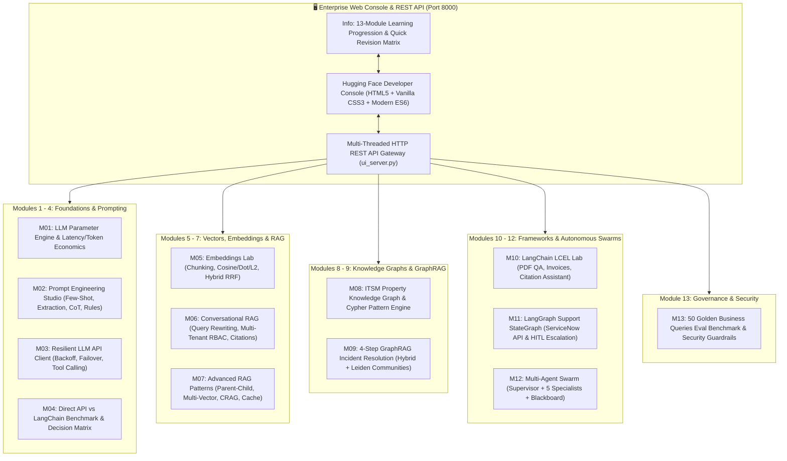

<div align="center">

# Enterprise GenAI Practical Engineering (Modules 1 - 13)

### *A Production-Grade Suite of LLM Foundations, Prompt Engineering, Resilient APIs, Vector Search, Advanced RAG, Knowledge Graphs, GraphRAG, LangChain, LangGraph HITL, Multi-Agent Swarms, and Evaluation Guardrails*

[](https://github.com/AkshayKulkarni1904/genai/actions/workflows/ci.yml)
[](https://www.python.org/downloads/)
[-brightgreen.svg)]()
[](https://opensource.org/licenses/MIT)
[](https://python.langchain.com/)
[](https://langchain-ai.github.io/langgraph/)
[]()
[]()

[**Interactive Web Console**](#-interactive-enterprise-web-console) • [**Architecture**](#-system-architecture) • [**Module Deep Dives**](#-detailed-module-portfolio) • [**REST API Reference**](#-rest-api-reference) • [**Quickstart**](#-quickstart--installation) • [**Evaluation Benchmarks**](#-evaluation--benchmark-results)

</div>

---

## 🌟 Overview

The **Enterprise GenAI Practical Engineering** repository is a comprehensive, production-grade implementation of the complete 13-module enterprise curriculum for Generative AI engineering.

Every module is built with rigorous software engineering principles: strict type safety (Pydantic v2), deterministic graph traversals (NetworkX), multi-source retrieval (Vector + Relational SQLite), state machine orchestration (LangGraph with Human-in-the-Loop), multi-agent supervisor systems, and a 50-query golden evaluation benchmark suite with security guardrails.

The repository includes a modern, high-performance **Hugging Face-inspired Interactive Web Console UI** (featuring a dedicated **Info / Learning Scope & Revision Reference** tab) and a **Master CLI Orchestrator** to run, inspect, and benchmark all 13 modules simultaneously.

---

## 🏛️ System Architecture



---

## 📑 Detailed Module Portfolio (Modules 1 - 13)

| Module | Core Theoretical Concepts | Practical Engineering Implementation | Key Highlights |
| :--- | :--- | :--- | :--- |
| [**Module 1: Foundations of GenAI & LLMs**](module_01_foundations/) | Tokens, context windows, BPE tokenization, sampling temperature, top-p, hallucination, grounding, GPU latency economics. | **LLM Parameter Engine & Tokenizer Sandbox** with live Groq LPU execution and token pricing calculator. | • Real-time token counter<br>• Latency & cost calculator<br>• Live Groq LPU generation |
| [**Module 2: Prompt Engineering**](module_02_prompt_engineering/) | Prompt anatomy, zero/few-shot, role directives, chain-of-thought, JSON schemas, defensive instructions, prompt injection. | **Enterprise Prompt Studio** with 4 specialized task presets (Support Triage, Contract Extraction, Meeting Synthesis, Policy Audit). | • Pydantic JSON schema<br>• Defense against injections<br>• Executive summary generation |
| [**Module 3: LLM APIs in Programming**](module_03_llm_apis/) | Resilient API clients, rate limits, exponential backoff, failover models, streaming deltas, function/tool calling dispatch. | **Resilient Multi-Provider API Client** with automatic fallback, function execution, and sliding-window token memory. | • Transparent failover routing<br>• JSON Schema tool dispatch<br>• Streaming delta processing |
| [**Module 4: Direct APIs vs LangChain**](module_04_direct_api_vs_langchain/) | Architectural trade-offs, abstraction overhead, execution latency, stack trace depth, dependency footprint, decision matrix. | **Side-by-Side Benchmark Workbench** measuring wall-clock latency, call frame depth, and memory overhead. | • Automated latency profiling<br>• Architectural decision matrix<br>• Concrete criteria checklist |
| [**Module 5: Embeddings & Vector Search**](module_05_embeddings_and_vector_search/) | Chunking strategies (Fixed, Recursive, Document-aware), Cosine/Dot/L2 distance, metadata filtering, Hybrid Reciprocal Rank Fusion (RRF). | **Embeddings & Vector Search Lab** with interactive chunking visualizer, metric comparator, and metadata filtering. | • Visual chunk boundaries<br>• Multi-metric ranking table<br>• Hybrid BM25 + Dense RRF |
| [**Module 6: Retrieval-Augmented Generation (RAG)**](module_06_rag_foundations/) | Conversational query rewriting, multi-tenant RBAC permissions, cross-encoder reranking, context assembly, citation provenance. | **Enterprise Knowledge Assistant** for HR policies and IT support with role-based document access controls and verifiable citations. | • Query coreference rewriting<br>• Tenant-isolated access<br>• Numbered citation markers |
| [**Module 7: Advanced RAG Patterns**](module_07_advanced_rag/) | Parent-Child chunking, multi-vector indexing, query decomposition, Corrective RAG (CRAG), semantic LRU caching, SQL metadata integration. | **Support-Resolution Assistant** resolving multi-tier enterprise support tickets across docs, incidents, and SQLite tenant configs. | • Dynamic sub-query generation<br>• Confidence-gated fallback<br>• SQLite live tenant metadata |
| [**Module 8: Knowledge Graph Fundamentals**](module_08_knowledge_graph/) | Property graphs, ontology vs. taxonomy, entity resolution, Cypher pattern matcher, ITSM modeling, graph governance. | **IT Support Knowledge Graph** linking Users, Devices, Apps, Incidents, Known Errors, Teams, and Remediation SOPs. | • Multi-hop relationship traversal<br>• Canonical alias resolution<br>• Interactive HTML5 canvas force graph |
| [**Module 9: GraphRAG**](module_09_graph_rag/) | Vector vs. GraphRAG, entity/relation extraction, Leiden community detection, local vs. global search, provenance chains. | **4-Step Incident Resolution GraphRAG Pipeline** (Identity → Hybrid Retrieve → Dependency Traverse → Provenance Recommendation). | • Multi-hop dependency path analysis<br>• Explainable audit trail<br>• Community-level summaries |
| [**Module 10: LangChain Framework**](module_10_langchain_framework/) | Models, Runnables, LCEL pipe operator syntax, recursive splitters, Pydantic structured output parsers, citation markers. | **Three Production Practicals**: PDF QA bot with page citations, structured invoice extraction, and verifiable citation assistant. | • Page attribution metadata<br>• Pydantic schema validation<br>• Numbered bibliographic references |
| [**Module 11: LangGraph Framework**](module_11_langgraph_framework/) | Stateful workflows, `TypedState`, cyclic graphs, tool calling, memory checkpoints, confidence evaluation, Human-in-the-Loop (HITL). | **Stateful IT Support StateGraph Workflow** integrating ServiceNow Table API, RAG playbook retrieval, and confidence-gated human escalation. | • Checkpointed execution traces<br>• Dynamic conditional routing<br>• Safe human escalation handoff |
| [**Module 12: Multi-Agent Systems**](module_12_multi_agent_systems/) | Supervisor-Worker architecture, specialized agent personas, shared blackboard state, safety boundaries, executive briefing generation. | **Multi-Agent Incident-Resolution System** coordinating 5 specialist agents (Triage, Retrieval, RCA, Validator, Escalation). | • Blackboard-mediated communication<br>• Pre-execution safety validation<br>• Executive incident briefing |
| [**Module 13: Evaluation & Guardrails**](module_13_evaluation_and_guardrails/) | 50 Golden Business Queries benchmark, Precision, Recall, Faithfulness, LLM-as-a-judge, PII redaction, prompt injection defense, RBAC filter. | **50 Business Queries Evaluation Suite** computing aggregate quality scores, pass/fail metrics, and failure taxonomy distributions. | • Multi-layer security guardrails<br>• 90.0% benchmark pass rate<br>• Automated failure taxonomy |

---

## 🖥️ Interactive Enterprise Web Console

The repository features a responsive, standalone Web Console running on `http://127.0.0.1:8000`.

### Key Features
- **Hugging Face Developer Aesthetic**: Clean typography, curated color tokens, card hover states, responsive layouts, and light/dark theme toggle.
- **Dedicated "Info" Learning Scope & Revision Tab**:
  - Interactive **13-Module Learning Progression Roadmap**.
  - **Quick Revision Mode**: 13 concise flashcards for fast 2-minute exam or review preparation.
  - **Master Learning Scope Table**: Bullet-style matrix covering What, Why, Concepts, and Practical for every module.
  - **Expandable Module Deep Dives**: Complete with *"Why these concepts?"* micro-explanations and Quick Recaps.
- **Interactive Playgrounds for All 13 Modules**: Live Groq LPU generation, prompt engineering templates, resilient API dispatching, vector search chunk visualization, interactive Force Graph canvas, GraphRAG pipeline tracer, LangGraph state inspector, Multi-Agent swarm war room, and live security guardrails.
- **Scenario Library**: 10+ realistic enterprise presets per module with custom prompt entry capabilities.
- **Global Search (⌘K / Ctrl+K)**: Quick jumping across all 13 modules, concepts, and tools.

---

## 🚀 Quickstart & Installation

### Prerequisites
- **Python 3.10+** (tested on Python 3.10, 3.11, 3.12, and 3.13)
- Git

### 1. Clone the Repository
```bash
git clone https://github.com/AkshayKulkarni1904/genai.git
cd genai
```

### 2. Set Up Virtual Environment

#### On Windows (PowerShell)
```powershell
.\setup_env.ps1
```

#### On Linux / macOS (Bash)
```bash
chmod +x setup_env.sh start_ui.sh
./setup_env.sh
```

#### Manual Virtual Environment Setup
```bash
python -m venv venv

# Windows:
.\venv\Scripts\Activate.ps1

# Linux / macOS:
source venv/bin/activate

# Install dependencies:
pip install -r requirements.txt
```

---

## 🏃 Execution Modes

### Option A: Launch Interactive Web Console (Recommended)
```bash
# Windows PowerShell:
.\start_ui.ps1

# Windows CMD:
.\start_ui.bat

# Linux / macOS:
./start_ui.sh

# Direct Python Server:
python ui_server.py --port 8000
```
Then open **[http://127.0.0.1:8000](http://127.0.0.1:8000)** in your browser.

---

### Option B: Master CLI Orchestrator
Execute all 13 modules end-to-end with rich terminal formatting:
```bash
python run_all.py
```

Execute a specific module by number:
```bash
python run_all.py 1   # Module 1: Foundations of GenAI & LLMs
python run_all.py 2   # Module 2: Prompt Engineering
python run_all.py 3   # Module 3: LLM APIs in Programming
python run_all.py 4   # Module 4: Direct APIs vs LangChain
python run_all.py 5   # Module 5: Embeddings & Vector Search
python run_all.py 6   # Module 6: RAG Foundations
python run_all.py 7   # Module 7: Advanced RAG Patterns
python run_all.py 8   # Module 8: Knowledge Graph Fundamentals
python run_all.py 9   # Module 9: GraphRAG
python run_all.py 10  # Module 10: LangChain Framework
python run_all.py 11  # Module 11: LangGraph Framework
python run_all.py 12  # Module 12: Multi-Agent Systems
python run_all.py 13  # Module 13: Evaluation & Guardrails
python run_all.py 14  # Launch Web Console
```

---

## 🧪 Automated Testing & CI/CD

The repository includes a comprehensive, automated test suite covering all 13 modules, REST endpoints, RAG pipelines, graph operations, LCEL chains, agent workflows, and guardrails:

```bash
# Run full pytest suite with verbose output:
pytest tests/ -v
```

```
============================= test session starts =============================
platform win32 -- Python 3.13.9, pytest-9.1.1
collected 15 items

tests/test_ui_api.py::test_api_status PASSED                             [  6%]
tests/test_ui_api.py::test_module1_foundations PASSED                    [ 13%]
tests/test_ui_api.py::test_module2_prompt_engineering PASSED             [ 20%]
tests/test_ui_api.py::test_module3_llm_apis PASSED                       [ 26%]
tests/test_ui_api.py::test_module4_direct_vs_langchain PASSED            [ 33%]
tests/test_ui_api.py::test_module5_embeddings_and_vector_search PASSED   [ 40%]
tests/test_ui_api.py::test_module6_rag_foundations PASSED                [ 46%]
tests/test_ui_api.py::test_module7_advanced_rag PASSED                   [ 53%]
tests/test_ui_api.py::test_module8_knowledge_graph PASSED                [ 60%]
tests/test_ui_api.py::test_module9_graphrag PASSED                       [ 66%]
tests/test_ui_api.py::test_module10_langchain PASSED                     [ 73%]
tests/test_ui_api.py::test_module11_langgraph PASSED                     [ 80%]
tests/test_ui_api.py::test_module12_multi_agent PASSED                   [ 86%]
tests/test_ui_api.py::test_module13_guardrails_and_eval PASSED           [ 93%]
tests/test_ui_api.py::test_unified_orchestrator_assessment PASSED        [100%]

============================= 15 passed in 2.62s ==============================
```

---

## 📊 Evaluation & Benchmark Results

Module 13 benchmarks the enterprise RAG pipelines against **50 Golden Business Queries** across 5 enterprise domains (Authentication, Billing, Infrastructure, Compliance, Security):

```
+-------------------------------------------------------------+
| Production Evaluation Suite Aggregate Report (N=50 Queries) |
+-----------------------------------+-------------------------+
| Evaluation Metric                 | Aggregate Score / Value |
+-----------------------------------+-------------------------+
| Total Golden Test Cases           | 50                      |
| Pass Rate Percentage              | 90.0%                   |
| Mean Retrieval Precision          | 1.000                   |
| Mean Retrieval Recall             | 1.000                   |
| Mean Faithfulness Score           | 0.724                   |
| Mean LLM-as-a-Judge Quality Score | 0.956 / 1.000           |
| Execution Duration                | 0.001 seconds           |
+-----------------------------------+-------------------------+
```

---

## 🔌 REST API Reference

The built-in HTTP server (`ui_server.py`) provides clean, JSON-based REST APIs:

| Method | Endpoint | Description | Sample Request / Response |
| :--- | :--- | :--- | :--- |
| `GET` | `/api/status` | System health check and 13-module inventory | `{"status": "online", "modules": [...]}` |
| `POST` | `/api/module1/simulate` | LLM token simulation & latency/cost profiling | `{"prompt": "...", "temperature": 0.7}` |
| `POST` | `/api/module2/run` | Prompt Engineering execution & schema validation | `{"task": "triage", "input_text": "..."}` |
| `POST` | `/api/module3/dispatch` | Resilient API client call with tool dispatching | `{"prompt": "...", "enable_tools": true}` |
| `POST` | `/api/module4/benchmark` | Direct API vs LangChain latency/stack comparison | `{"query": "...", "iterations": 3}` |
| `POST` | `/api/module5/search` | Vector search & chunk visualization | `{"query": "...", "metric": "cosine"}` |
| `POST` | `/api/module6/rag` | Conversational RAG with RBAC & citations | `{"query": "...", "role": "Employee"}` |
| `POST` | `/api/module7/resolve` | Advanced RAG ticket resolution | `{"customer_id": "CUST-901", "query": "SSO error"}` |
| `GET` | `/api/module8/graph` | Fetch IT Support Knowledge Graph topology | `{"nodes": [...], "edges": [...]}` |
| `POST` | `/api/module8/cypher` | Execute Cypher graph pattern query | `{"pattern": "MATCH (i:Incident)..."}` |
| `POST` | `/api/module8/resolve-entity` | Normalize raw text alias to canonical ID | `{"alias": "postgres"}` → `APP::ACME::pg_cluster` |
| `POST` | `/api/module9/resolve` | Execute 4-Step GraphRAG pipeline | `{"incident": {"product": "Checkout API", ...}}` |
| `POST` | `/api/module10/pdf-qa` | Run PDF QA bot with page citations | `{"query": "What is the encryption standard?"}` |
| `POST` | `/api/module10/invoice` | Parse unstructured invoice to Pydantic model | `{"text": "Invoice #..."}` |
| `POST` | `/api/module10/citations` | Generate answer with numbered citations | `{"query": "API secrets rotation policy"}` |
| `POST` | `/api/module11/workflow` | Execute stateful LangGraph support workflow | `{"ticket_id": "INC-10091", "confidence_threshold": 0.75}` |
| `POST` | `/api/module12/multiagent` | Run 5-specialist multi-agent incident solver | `{"incident": {"incident_id": "INC-01", ...}}` |
| `POST` | `/api/module13/guardrails` | Inspect PII, injection attacks, and RBAC | `{"prompt": "...", "user_role": "Engineering"}` |
| `POST` | `/api/module13/eval` | Run 50 Golden Business Queries benchmark | Returns precision, recall, faithfulness, LLM judge |
| `POST` | `/api/orchestrator/run-all` | Execute comprehensive assessment of all 13 modules | Verifies health of all modules |

---

## 🤝 Contributing

Contributions are welcome! Please read the [Contributing Guidelines](CONTRIBUTING.md) and [Code of Conduct](CODE_OF_CONDUCT.md) before submitting pull requests.

1. Fork the Project
2. Create your Feature Branch (`git checkout -b feature/AmazingFeature`)
3. Commit your Changes (`git commit -m 'feat: add some amazing feature'`)
4. Push to the Branch (`git push origin feature/AmazingFeature`)
5. Open a Pull Request

---

## 📄 License

Distributed under the **MIT License**. See [`LICENSE`](LICENSE) for more information.

<div align="center">
  <sub>Engineered with precision for the Enterprise GenAI Engineering Curriculum by <a href="https://github.com/AkshayKulkarni1904">Akshay Kulkarni</a>.</sub>
</div>
